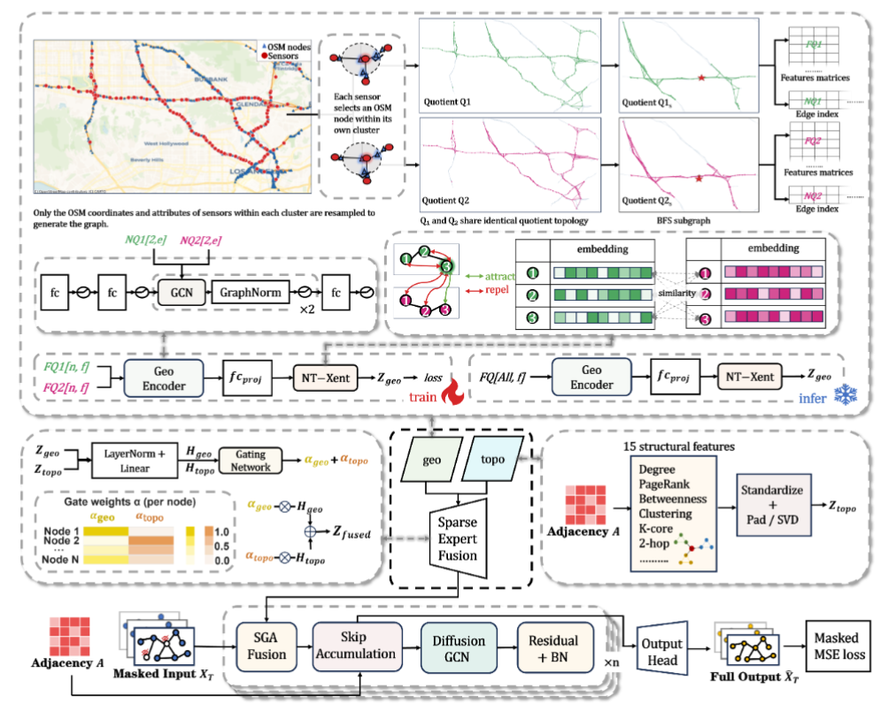

# TGEO_bundle

Minimal release bundle for **T-GEO** (GraphWaveNet + geo/topo pretraining + TopoMoE fusion) on **METRLA** and **PEMSBAY**: datasets, model code, and one trained **geo+topo+GWN** checkpoint per dataset.

Code and checkpoints are taken from `9993/6-10`.

## Framework

<p align="center">
  
</p>

## Directory layout

```
TGEO_bundle/
├── README.md
├── framework.png           # model overview figure
├── METRLA/                 # dataset (symlinks to topo+Harmonic+GWN)
│   ├── metr-la.h5
│   ├── adj_mx.pkl
│   ├── graph_sensor_locations.csv
│   └── osm_graph_cache.pkl
├── PEMSBAY/
│   ├── pems-bay.h5
│   ├── adj_mx_bay.pkl
│   └── graph_sensor_locations_bay.csv
├── save/                   # geo_topo checkpoints (one set per dataset)
│   ├── METRLA/             # seed=100
│   └── PEMSBAY/            # seed=44
└── code/                   # training / evaluation entrypoints
    ├── pred_maskpredition_GWN_scpt_geo.py
    ├── pred_maskpredition_GWN_scpt_geo_topomoe.py
    ├── pred_maskpredition_GWN_scpt_geo_topomoe_virtualnode_splitmask.py  # recommended
    ├── GWN_SCPT_14_adpAdj_mask_infill.py   # GraphWaveNet model
    ├── graph.py                            # quotient graph / geo encoder
    ├── topo_moe_utils.py                   # MoE fusion & topology embedding
    ├── unseen_nodes.py                     # spatial split
    ├── Metrics.py
    └── Utils.py
```

## Model overview

| Component | Description |
|-----------|-------------|
| **topo pretrain** | `Contrastive_FeatureExtractor_conv`, contrastive learning on traffic subgraphs → `pretrain_topo.pt` |
| **geo pretrain** | `Geometric_Encoder`, contrastive learning on OSM quotient graphs → `pretrain_geo.pt` |
| **GWN** | GraphWaveNet mask-imputation backbone → `best.pt` |
| **TopoMoE** | Fuses **geometric** (geo-pretrained embed) and **topology** (Laplacian embed) → `fusion_u.pt` |

Full configuration is **geo_topo**: `MOE_EXPERTS=geo,topo`, `MOE_TOP_K=2`.

## Checkpoint files

Each `save/<DATASET>/` directory contains:

| File | Role |
|------|------|
| `best.pt` | GraphWaveNet weights |
| `fusion_u.pt` | MoE gating network |
| `pretrain_topo.pt` | topo pretraining weights |
| `pretrain_geo.pt` | geo pretraining weights |
| `topology_embed_D32_lap16.npz` | cached topology Laplacian embedding |
| `mask_policy.json` | test-node split policy (includes seed) |

Original training runs under `9993/6-10/save`:

- METRLA: `est_METRLA_GraphWaveNet_2606090549_3314074`
- PEMSBAY: `est_PEMSBAY_GraphWaveNet_2606071700_1222102`

## Dependencies

- Python 3.x
- PyTorch
- `torch_geometric`
- `numpy`, `pandas`, `scipy`, `scikit-learn`, `networkx`
- Optional for geo pretrain: `osmnx` (set `OFFLINE_OSM=1` for kNN proxy graphs without network; METRLA includes `osm_graph_cache.pkl`)

Recommended conda env: `AutoTSenv` (same as the main experiments).

## Usage

Run all commands from `code/` (data paths are `../METRLA` and `../PEMSBAY`).

### Evaluation only (load bundled checkpoints)

METRLA example with `tst_v_full`:

```bash
cd code

export FORECASTING_EVAL_DIR="$(cd ../save/METRLA && pwd)"
export FORECASTING_EVAL_MODE=tst_v_full
export MOE_EXPERTS=geo,topo
export MOE_TOP_K=2

python pred_maskpredition_GWN_scpt_geo_topomoe_virtualnode_splitmask.py \
  1 0.7 0 100 1.0 METRLA -1 1 0.0 1 1 2 64 0.01 100 100 0 0.001 1 320 \
  topo_moe 64 16 2 1.0 0.001 0.001 0.0 1
```

For PEMSBAY, use `PEMSBAY`, point `FORECASTING_EVAL_DIR` to `../save/PEMSBAY`, and set argv seed (`argv[4]`) to `44`:

```bash
export FORECASTING_EVAL_DIR="$(cd ../save/PEMSBAY && pwd)"
export FORECASTING_EVAL_MODE=tst_v_full
export MOE_EXPERTS=geo,topo
export MOE_TOP_K=2

python pred_maskpredition_GWN_scpt_geo_topomoe_virtualnode_splitmask.py \
  1 0.7 0 44 1.0 PEMSBAY -1 1 0.0 1 1 2 64 0.01 100 100 0 0.001 1 320 \
  topo_moe 64 16 2 1.0 0.001 0.001 0.0 1
```

`FORECASTING_EVAL_MODE` options: `tst_v_full` (SplitMask, fully masked unseen nodes), `tst_u`, `tst_a`.

### Training from scratch

Without `FORECASTING_EVAL_DIR`, a new run is written to `../save/est_<DATASET>_GraphWaveNet_<timestamp>_<pid>/`:

```bash
cd code

export MOE_EXPERTS=geo,topo
export MOE_TOP_K=2

python pred_maskpredition_GWN_scpt_geo_topomoe_virtualnode_splitmask.py \
  1 0.7 0 100 1.0 METRLA -1 1 0.0 1 1 2 64 0.01 100 100 0 0.001 1 320 \
  topo_moe 64 16 2 1.0 0.001 0.001 0.0 1
```

Pipeline: topo pretrain → geo pretrain → joint GWN + TopoMoE training → testing.

## Artifact naming

Pretraining loads `pretrain_topo.pt` / `pretrain_geo.pt` first; falls back to `pretrain_temporal.pt`, `encoder.pt`, etc.

Main model and fusion use `best.pt` / `fusion_u.pt`; legacy names such as `GraphWaveNet_best.pt` are also supported.

## Data

Large files under `METRLA/` and `PEMSBAY/` are symlinks into `9993/topo+Harmonic+GWN/`. Replace them with real copies for a fully self-contained offline bundle.
